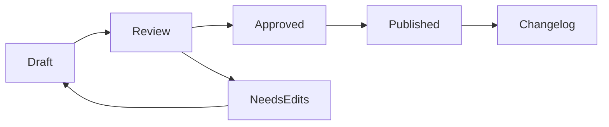

# Review workflow



### Identify the change

Capture the impacted policy, owner, source system, and requested effective date.



### Edit the GitBook page

Update the policy page directly so the approved guidance is readable, searchable, and available to AI.



### Review with compliance

Route high-risk updates through compliance review and record the approval date in page metadata.



### Publish and announce

Publish the update and add an entry to the changelog section for affected teams.



