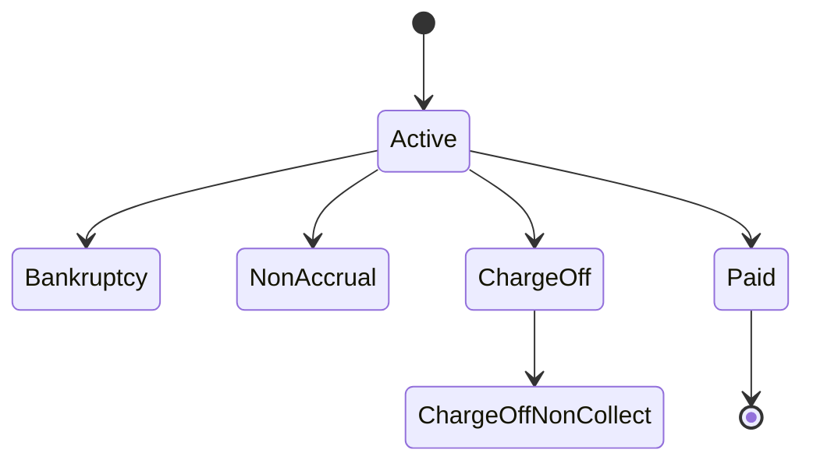

# Account statuses

| Status | Source approval date | Operational meaning |
| --- | --- | --- |
| Active | 03/14/2024 | Account remains in standard servicing. |
| Bankruptcy | 03/14/2024 | Account requires restricted servicing and escalation checks. |
| Non-accrual | 03/14/2024 | Account requires non-accrual handling before balance updates. |
| Charge-off | 03/14/2024 | Account has met charge-off criteria and requires related servicing rules. |
| Charge-off non-collect | 03/14/2024 | Account is designated non-collect after charge-off. |
| Paid | 03/14/2024 | Account is paid and moves toward closure handling. |



Use the active status when normal servicing continues. Validate balance, payment schedule, and communication preferences before making updates.



Bankruptcy status should send readers to restricted contact rules, documentation requirements, and escalation owners.



Charge-off policy should separate status classification, collection handling, and non-collect designation.



## Status lifecycle

Imported placeholder body treatment

The source document includes placeholder paragraphs and bullet lists under each status. In a production import, each paragraph would be preserved under the relevant status, while notes and exceptions would become hints or expandable blocks.

