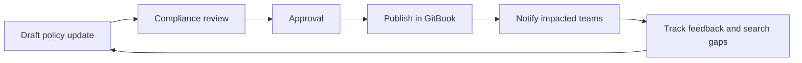

# Policy Knowledge Base



Arivo teams need a fast, trusted place to find policy guidance, understand ownership, and keep many policies current. This demo turns the supplied Account Servicing policy sample into an internal knowledge base with structured policy pages, review metadata, and workflow-oriented blocks.

<table data-view="cards"><thead><tr><th></th><th></th><th></th><th data-hidden data-card-target data-type="content-ref"></th></tr></thead><tbody>
<tr>
  <td><h3><i class="fa-file-shield" style="color:#F68D21;"></i></h3></td>
  <td><strong>Browse policy library</strong></td>
  <td>Start with Account Servicing and drill into status, payment, and communication policy areas.</td>
  <td><a href="policy-library/account-servicing.md">account-servicing</a></td>
</tr>
<tr>
  <td><h3><i class="fa-arrows-rotate" style="color:#F68D21;"></i></h3></td>
  <td><strong>Run a policy review</strong></td>
  <td>Use a repeatable review workflow for policy owners, compliance, and operational leaders.</td>
  <td><a href="workflows/policy-review-workflow.md">policy-review</a></td>
</tr>
<tr>
  <td><h3><i class="fa-tags" style="color:#F68D21;"></i></h3></td>
  <td><strong>Check controls</strong></td>
  <td>See how approval dates, owners, source systems, and operational tags can be standardized.</td>
  <td><a href="reference/policy-metadata-and-controls.md">metadata-controls</a></td>
</tr>
</tbody></table>

## Demo story


{% column width="50%" %}
### For policy readers

Find the right policy quickly, scan the latest approved guidance, and expand detailed rules only when needed.


{% column width="50%" %}
### For policy owners

Keep review cycles visible, separate policies from procedures, and make ownership obvious across many documents.



## Source assets used


Sample Account Servicing policy document supplied for the proof of concept.

