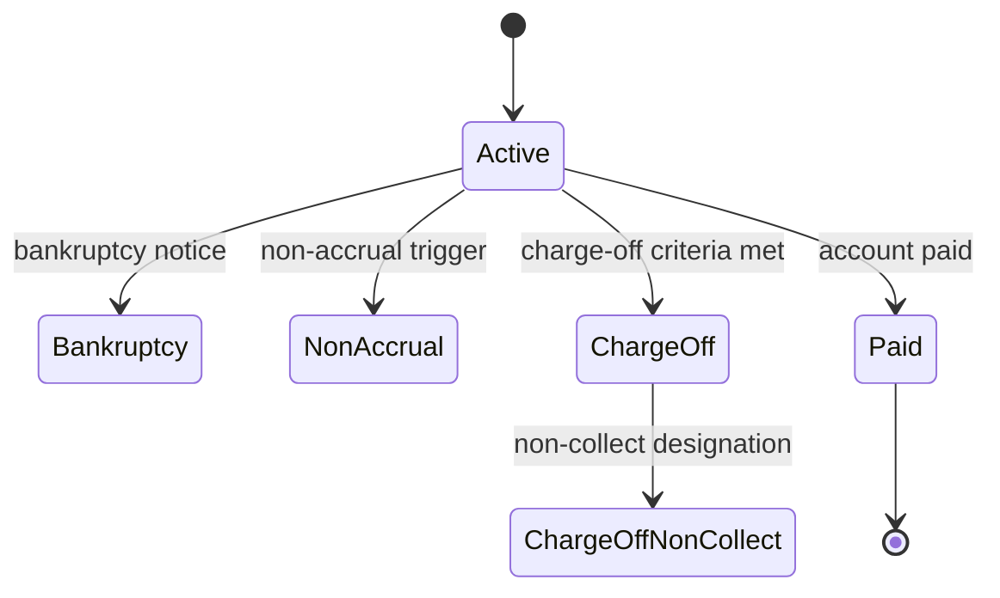

# Account statuses

Account status policies help servicing teams understand how an account should be handled in Norman LMS and related workflows.

| Status | Sample approval date | Reader action |
| --- | --- | --- |
| Active | 03/14/2024 | Continue standard servicing and payment handling. |
| Bankruptcy | 03/14/2024 | Follow restricted servicing and escalation guidance. |
| Non-accrual | 03/14/2024 | Review non-accrual handling before making balance updates. |
| Charge-off | 03/14/2024 | Confirm charge-off procedures and exceptions. |
| Paid | 03/14/2024 | Verify paid status treatment and closure steps. |


In a production IKB, each status can be tagged by risk level, department, source system, and last review date so employees can filter policy content by the work they are doing.


## Status lifecycle

## Operational guidance



Use the active status when the account remains in standard servicing. Confirm account balance, next due date, and communication preferences before making changes.



Bankruptcy status should route readers to required restrictions, documentation checks, and escalation owners before any collection activity.



Charge-off guidance should clearly separate account status, collection handling, and any non-collect designation.



Sample source note

The supplied document includes placeholder policy language and repeated "Approved 03/14/2024" status approvals. In the demo, this becomes structured metadata rather than buried body text.

