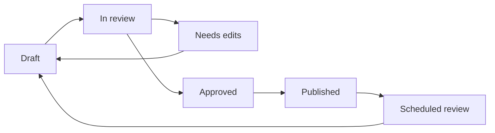

# Review and approval workflow

This workflow shows how Arivo could manage policy changes in GitBook while making ownership and approval state visible to internal teams.



### Intake the change

Capture the requested policy change, affected teams, related source systems, and target effective date.



### Draft in context

Edit the affected GitBook page, keeping reader-facing guidance separate from long exception details.



### Route compliance review

Assign the reviewer, capture comments, and confirm whether the page needs legal, operations, or leadership sign-off.



### Publish and notify

Publish the approved update and notify impacted servicing teams with the page link, change summary, and effective date.



### Monitor feedback

Use page feedback, search terms, and repeated support questions to decide where guidance needs to be clarified.



## Approval states

## Review dashboard concept

| Signal | Example | Action |
| --- | --- | --- |
| Policy stale date | Payix approved 08/30/2018 | Prioritize review. |
| High-risk topic | Customer communication | Require compliance reviewer. |
| Search gap | "door knock order" has poor results | Add aliases or restructure page. |
| Page feedback | "Need state-specific rules" | Add expandable state guidance. |

